基于SpringBoot的企业oa管理系统（程序+论文）
=
- 完整代码获取地址：从戎源码网 ([https://armycodes.com/](https://armycodes.com/))
- 作者微信：19941326836  QQ：952045282 
- 承接计算机毕业设计、Java毕业设计、Python毕业设计、深度学习、机器学习
- 选题+开题报告+任务书+程序定制+安装调试+论文+答辩ppt 一条龙服务
- 所有选题地址https://github.com/nature924/allProject

一、项目介绍
---
基于Spring Boot框架实现的企业oa管理系统，系统包含两种角色：管理员、用户，主要功能如下。

### 管理员：
1. 个人中心：管理管理员个人信息和进行相关操作。
2. 用户管理：管理用户的基本信息和权限设置。
3. 公告信息管理：发布和管理企业内部公告信息。
4. 客户关系管理：管理客户信息、跟进记录和销售机会等。
5. 通讯录管理：管理企业内部员工通讯录信息。
6. 日程安排管理：管理个人和团队的日程安排和会议安排。
7. 车辆信息管理：管理企业车辆的基本信息和使用情况。
8. 文件信息管理：管理企业内部文件的上传、下载和共享。
9. 工作日志管理：记录和管理员工的工作日志和任务完成情况。
10. 上班考勤管理：管理员工的上班打卡和考勤记录。
11. 工资信息管理：管理员工的工资信息和薪资发放。

### 用户：
1. 个人中心：管理个人信息和进行相关操作。
2. 公告信息管理：查看和阅读企业内部公告信息。
3. 客户关系管理：查看和管理与自己相关的客户信息和销售机会。
4. 通讯录管理：查找和查看企业内部员工通讯录信息。
5. 日程安排管理：查看和管理个人的日程安排和会议安排。
6. 车辆信息管理：查看和申请企业车辆的使用情况。
7. 文件信息管理：查看和下载企业内部文件。
8. 工作日志管理：记录和管理个人的工作日志和任务完成情况。
9. 上班考勤管理：查看个人的上班打卡和考勤记录。
10. 工资信息管理：查看个人的工资信息和薪资发放情况。

二、项目技术
---
- 编程语言：Java
- 数据库：MySQL
- 项目管理工具：Maven
- 前端技术：VUE、HTML、Jquery、Bootstrap
- 后端技术：Spring、SpringMVC、MyBatis

三、运行环境
---
- 操作系统：Windows、macOS都可以
- JDK版本：JDK1.8以上都可以
- 开发工具：IDEA、Ecplise、Myecplise都可以
- 数据库: MySQL5.7以上都可以
- Tomcat：任意版本都可以
- Maven：任意版本都可以

四、运行截图
---
### 论文截图：
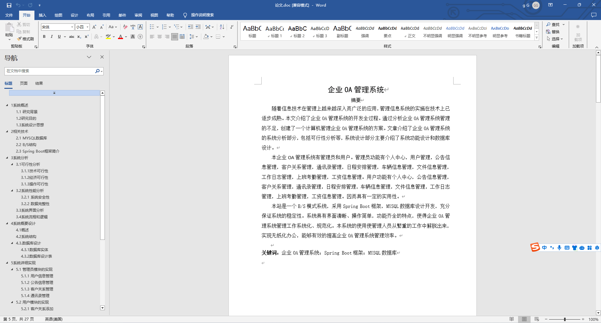
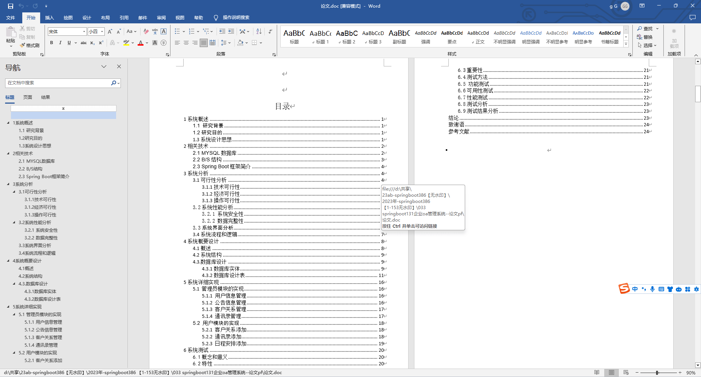

### 程序截图：
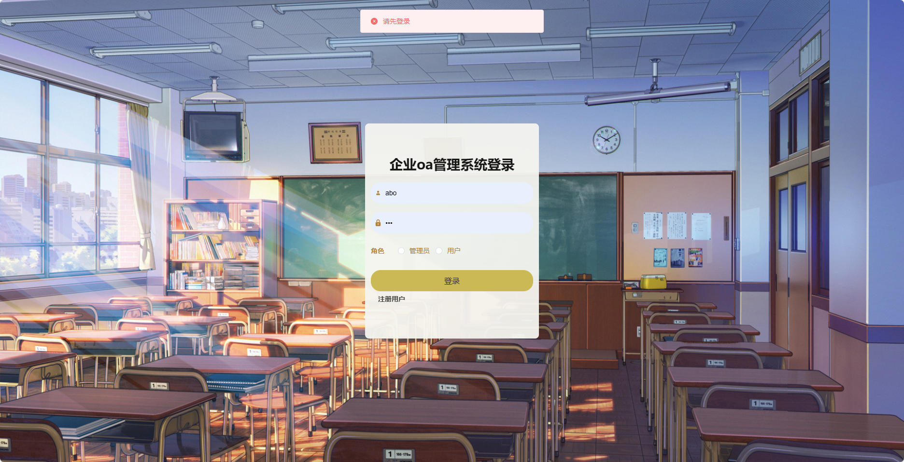

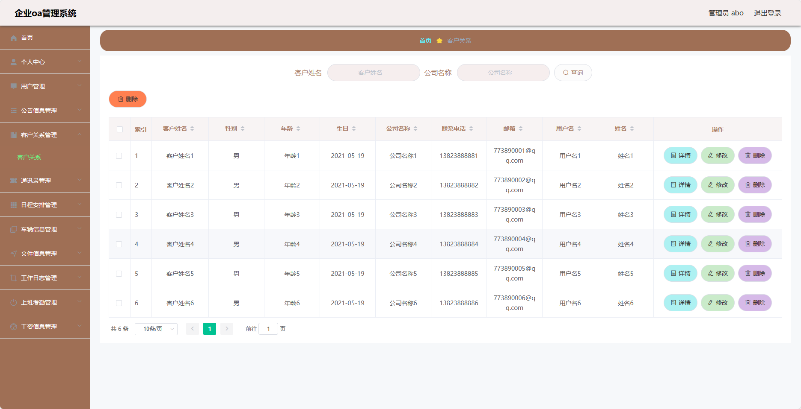
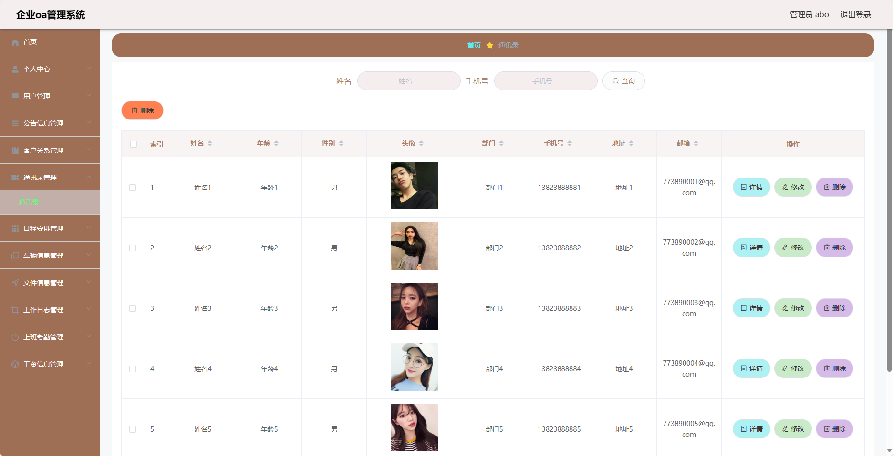
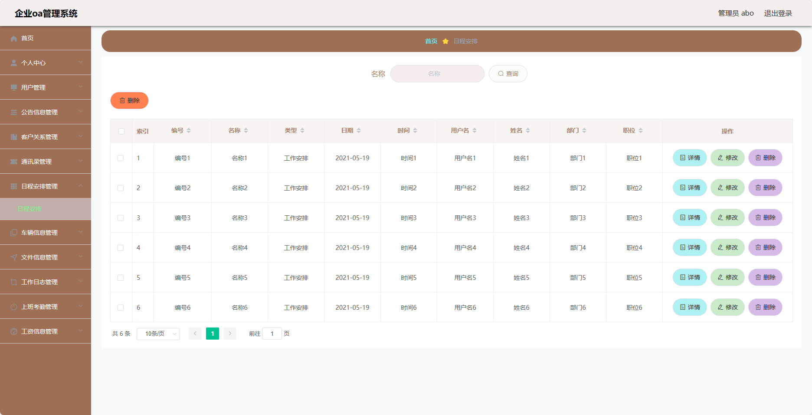
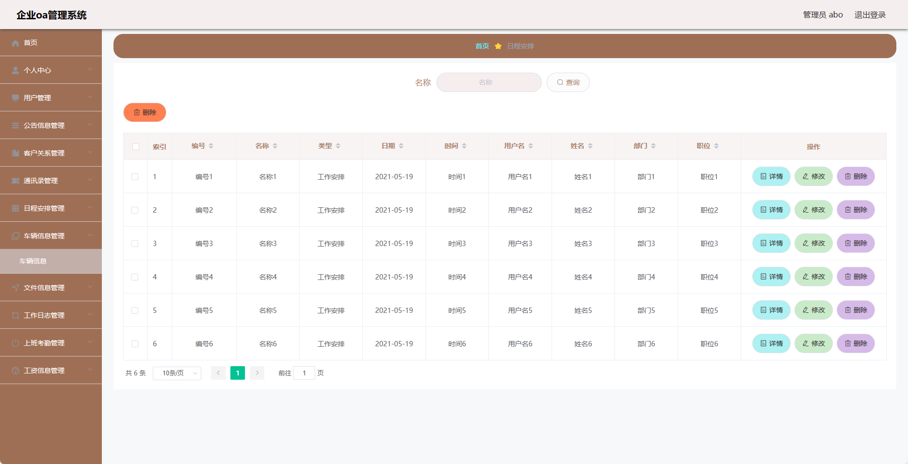
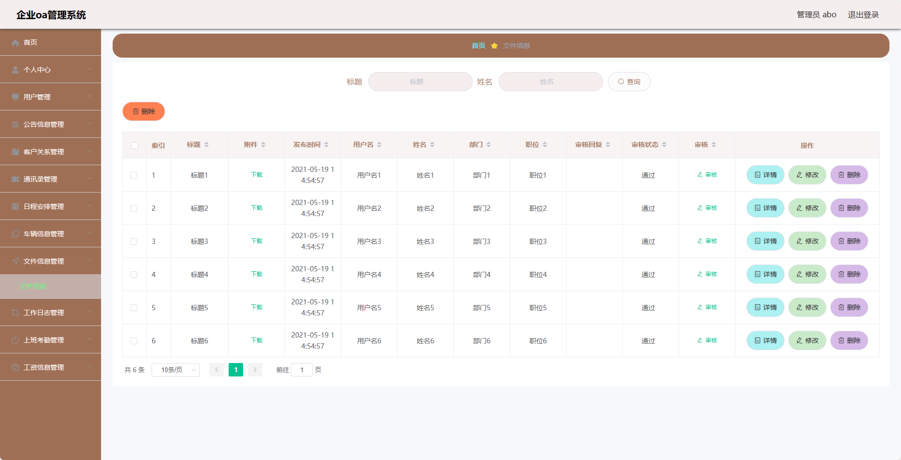
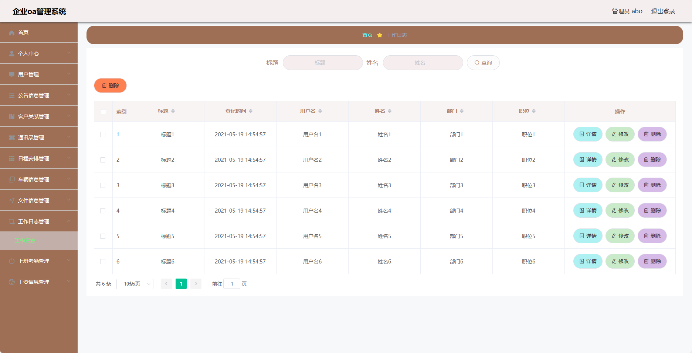
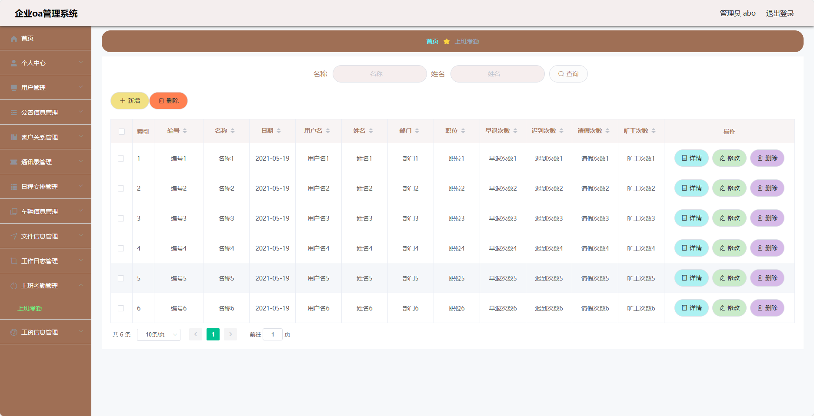
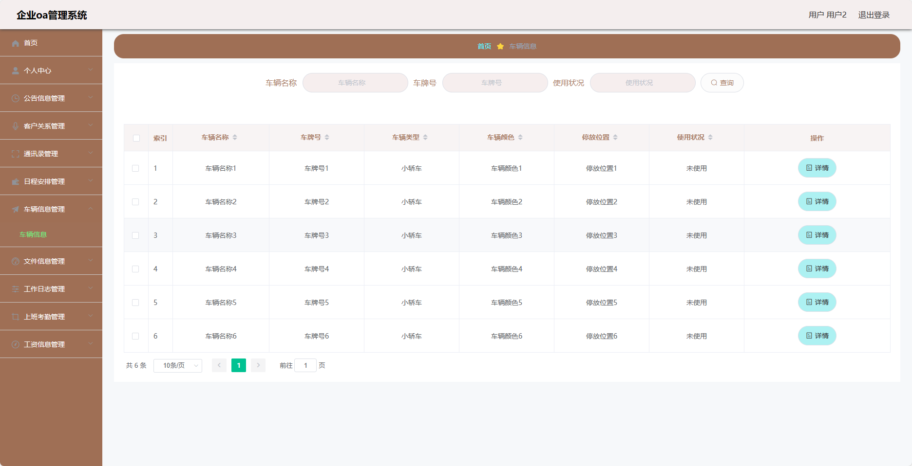

